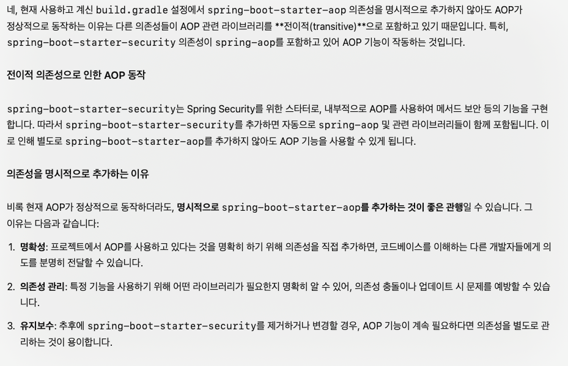
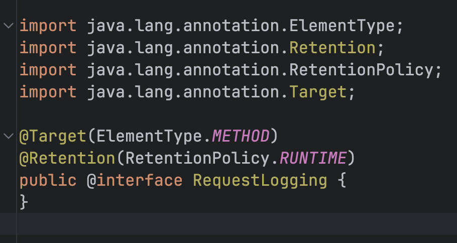
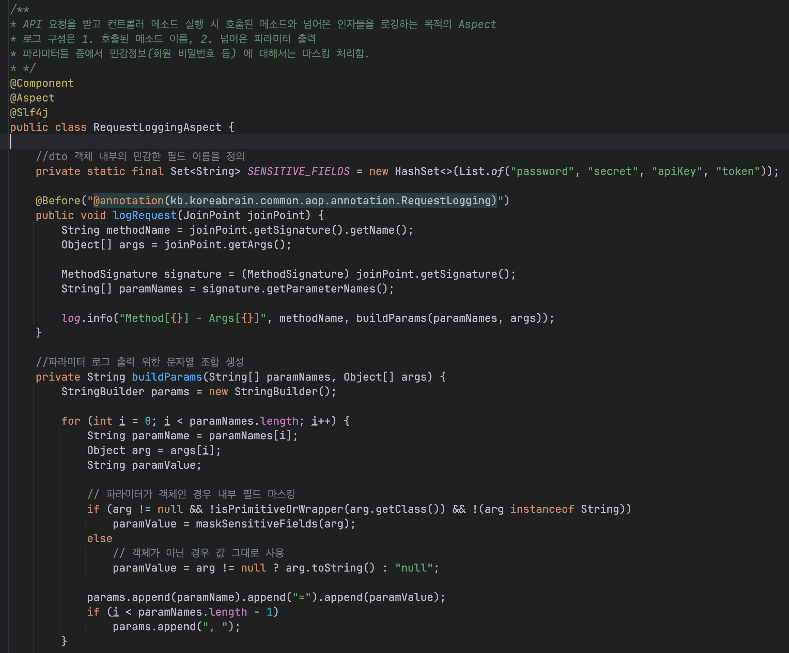
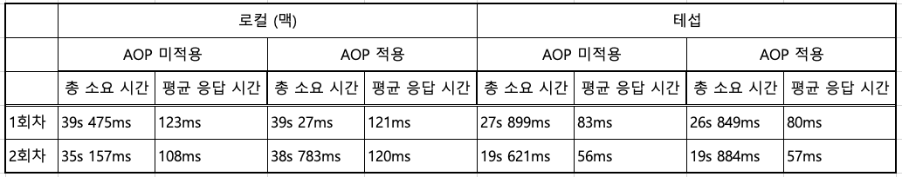

### AOP 적용해보기
---

#### 실무프로젝트에서 AOP 추가해보기

- 코\*\*브\*\* 프로젝트에 api 요청 받는 컨트롤러 메소드 단의 **공통 로깅 Aspect** 추가하기   
- 커스텀 어노테이션 만들고 그것으로 Aspect 적용하기   
 
구현 조건

- 새롭게 만든 어노테이션이 적용된 메소드 호출 시에 로그를 찍는다. (어노테이션 달지 않으면 로깅 안찍는다.)   
- 로그 구성은 1. 호출된 메소드 이름, 2. 넘어온 파라미터 출력
- 파라미터들 중에서 민감정보(회원 비밀번호 등) 에 대해서는 제외할 수 있으면 좋겠음.
 
적용 효과

- 이 로그들을 통해 실제 사용자의 사용 흐름을 파악할 수 있다. (무슨 동작들을 했는 지 파악)
- 오류 상황에서 화면에서 어떤 파라미터들을 넘겼길래 특정 오류가 나는 지를 파악할 수 있다.

---

#### 공통 로깅 Aspect 적용 과정

1. spring AOP 디펜던시 추가    
그런데 aop 를 추가하지 않아도 시큐리티 내부에 자동적으로 aop 도 추가된다고 함.   

2. 로깅aspect 적용할 포인트컷 용도의 어노테이션 생성   

3. Aspect 클래스 생성   

(Aspect 클래스의 코드 설명은 직접 보면서 진행)

--- 

### 성능 테스트

(성능테스트 캡처사진 보면서 설명 진행)

성능차이는 크지 않은 것으로 확인됨.

