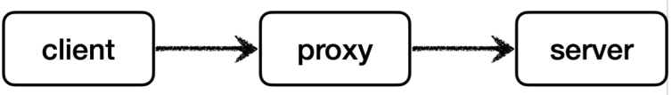
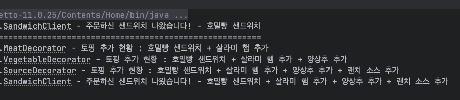

# 데코레이터 패턴

---

## 공부하면서 인상 깊었던 내용 정리

- 프록시 패턴의 요청 흐름
  


- 데코레이터 패턴의 요청 흐름
  


<br>

- 프록시 패턴, 데코레이터패턴은 형태는 거의 동일한데, **의도** 에 따라서 구분될 뿐이다.
데코레이터 패턴 또한 **프록시 기술**을 사용하는 것은 동일하다.
프록시 패턴 : 접근제어가 목적
데코레이터 패턴 : 새로운 기능 추가가 목적

<br>

- **프록시**라는 기술적인 의미와 **프록시 패턴** 이라는 디자인패턴의 의미는 다른 것이다.
**프록시패턴**은 디자인패턴 중 하나로 그냥 이름을 그렇게 지은 것이라고 함.
그래서 프록시패턴만이 프록시 기술을 사용하는 것은 아니다.

<br>

#### 프록시 기술에 대해
  
**프록시(proxy)** 란? 
'대리', '대신'이라는 뜻을 가지며, 통신 프로토콜에 있어서는 대리 응답 등에서 사용하는 개념이다.
주로 프록시 서버(proxy server) 와 같이 네트워크 개념에서도 자주 쓰인다.
```
프록시 서버를 사용하는 이유

개인정보를 보호할 수 있다
프록시 서버 없이 클라이언트가 서버에 요청 시 본인의 IP 주소가 노출되는데, 프록시 서버를 사용 시 서버측에서 나의 IP가 아닌 프록시 서버의 IP를 보게 된다.
즉, IP를 숨길 수 있다.


캐시를 사용해서 속도가 향상된다
프록시 서버는 웹페이지를 가져올 때 자신의 DB에 최근 데이터를 저장하는데, 이것을 Cache라 한다.
이렇게 될 시, 같은 요청이 들어오면 Cache자원을 반환하여 서비스의 속도를 높이고 대역폭도 줄일 수 있다.


로그를 기록, 관리할 수 있다
서버 측에선 클라이언트의 기록대신 프록시 서버의 기록이 있지만, 프록시 서버에겐 클라이언트의 기록이 남아있다.
이 기록들을 보면 어떤 IP에서 어떤 IP로 얼마나 접속해 있는지 확인할 수 있고, 특정 IP가 방문할 수 있는 웹사이트도 제한할 수 있어서 회사에서 많이 사용한다.


접속을 우회할 수 있다
특정 사이트에서 IP를 검사해 한국에서의 접속을 차단하는 경우가 있는데, 이런 경우 프록시 서버를 사용해 접속 시 다른나라에서 접속한 것처럼 우회할 수 있다.
```
위는 통신 네트워크 개념에서 사용하는 이유들인데, 
위의 사유들이 프로그래밍 소스코드 쪽에서도 비슷한 이유로 사용된다고 느껴짐.
아래는 이번 강의에서 설명해준 프록시 기술의 주요 기능들임.
```
프록시의 주요 기능 (프로그래밍 관점)

프록시를 통해서 할 수 있는 일은 크게 2가지로 구분할 수 있다.

- 접근 제어
권한에 따른 접근 차단
캐싱
지연 로딩

- 부가 기능 추가
원래 서버가 제공하는 기능에 더해서 부가 기능을 수행한다.
예) 요청 값이나, 응답 값을 중간에 변형한다.
예) 실행 시간을 측정해서 추가 로그를 남긴다.

프록시 객체가 중간에 있으면 크게 접근 제어와 부가 기능 추가를 수행할 수 있다.
```

<br>

그런데 찾아보다보니 시중에 나와있는 프록시 서버 기술 활용은
과거에 인터넷 속도가 느렸을 당시 많이 쓰였었다고 하는데, 현재는
(내가 모르는 것일 수 있지만) 
대부분 국가나 특정한 네트워크 환경 상에서 
접속하지 못하도록 IP 제한을 하는 경우를 
우회하는 목적으로 사용되는 것 같다.
참고로 VPN 기술과 유사해보이지만 차이점이 있다.


더 자세한 내용은 
https://surfshark.com/ko/blog/vpn-vs-proxy 참고

<br>

#### 프로그래밍 관점에서의 프록시 기술이 사용되는 예시들 (특히 자바, 스프링, JPA 중에서)

1. JPA 지연로딩
   프록시객체로 초기화 시켜놓고 엔티티의 데이터가 필요하여 호출하는 순간에 실제 엔티티를 조회해오는 식.

2. 스프링 AOP
   메서드 호출 시 부가적인 로직을 삽입하기 위해 프록시 객체를 사용한다.

3. 트랜잭션 관리
   @Transactional 애노테이션이 적용된 클래스나 메서드에 대해 프록시가 생성된다.
   프록시는 메서드 호출 시 트랜잭션을 시작하고, 메서드 실행 후 성공 시 커밋, 실패 시 롤백한다.

4. 캐싱 (@Cacheable 어노테이션)
   프록시는 메서드 호출 시 캐시를 먼저 확인하고, 캐시된 결과가 있으면 이를 반환하며, 없으면 실제 메서드를 실행하고 결과를 캐시에 저장한다.

5. 프록시를 이용한 테스트코드 및 모킹(Mock)
   Mockito 같은 라이브러리를 사용하여 프록시(또는 목 객체)를 생성하고, 테스트 대상에 주입한다.

<br>

### 데코레이터 패턴 실습

```
public interface Sandwich {
    String buySandwich();
}
```
```
public class BasicSandwich implements Sandwich {

    @Override
    public String buySandwich() {
        return "호밀빵 샌드위치";
    }
}
```
```
@Slf4j
public class MeatDecorator implements Sandwich{

    private Sandwich sandwich;

    public MeatDecorator(Sandwich sandwich) {
        this.sandwich = sandwich;
    }

    @Override
    public String buySandwich() {
        String buySandwich = sandwich.buySandwich();
        log.info("토핑 추가 현황 : " + buySandwich + " + 살라미 햄 추가");
        return buySandwich + " + 살라미 햄 추가";
    }
}
```
```
@Slf4j
public class VegetableDecorator implements Sandwich {

    private Sandwich sandwich;

    public VegetableDecorator(Sandwich sandwich) {
        this.sandwich = sandwich;
    }

    @Override
    public String buySandwich() {
        String buySandwich = sandwich.buySandwich();
        log.info("토핑 추가 현황 : " + buySandwich + " + 양상추 추가");
        return buySandwich + " + 양상추 추가";
    }
}
```
```
@Slf4j
public class SourceDecorator implements Sandwich {

    private Sandwich sandwich;

    public SourceDecorator(Sandwich sandwich) {
        this.sandwich = sandwich;
    }

    @Override
    public String buySandwich() {
        String buySandwich = sandwich.buySandwich();
        log.info("토핑 추가 현황 : " + buySandwich + " + 랜치 소스 추가");
        return buySandwich + " + 랜치 소스 추가";
    }
}
```
```
@Slf4j
public class SandwichClient {

    private Sandwich sandwich;

    public SandwichClient(Sandwich sandwich) {
        this.sandwich = sandwich;
    }

    public void orderSandwich() {
        String boughtMySandwich = sandwich.buySandwich();
        log.info("주문하신 샌드위치 나왔습니다! - " + boughtMySandwich);
    }
}
```
```
@Slf4j
@DisplayName("성민 데코레이터 패턴 테스트")
public class KsmDecoratorPatternTest {


    @Test
    @DisplayName("기본 샌드위치만 주문하기")
    void ksmDecorator1() {
        Sandwich sandwich1 = new BasicSandwich();

        SandwichClient client = new SandwichClient(sandwich1);
        client.orderSandwich();

        System.out.println("==============================================================================================================");
    }

    @Test
    @DisplayName("샌드위치 토핑 추가 주문하기")
    void ksmDecorator2() {
        Sandwich sandwich1 = new BasicSandwich();
        Sandwich sandwich2 = new MeatDecorator(sandwich1);
        Sandwich sandwich3 = new VegetableDecorator(sandwich2);
        Sandwich sandwich4 = new SourceDecorator(sandwich3);

        SandwichClient client = new SandwichClient(sandwich4);
        client.orderSandwich();
    }
}
```
- 실행 결과
  



