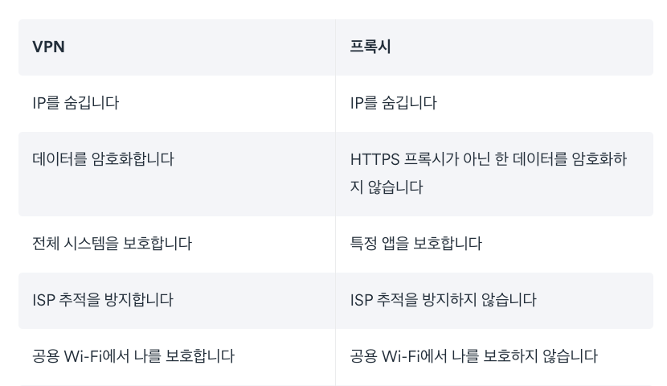
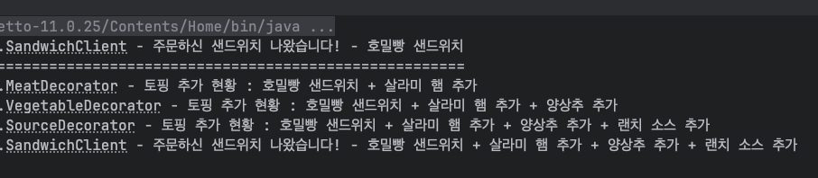
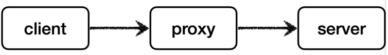
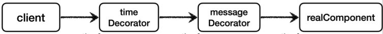
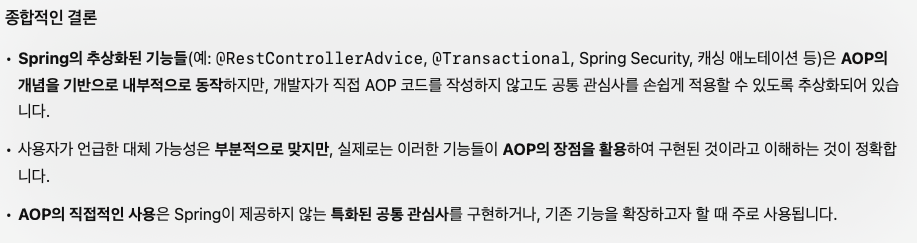

# 주관적인 내용 간단 요약

---

### 용어 정리
- 조인 포인트(Join point) - 부가기능(어드바이스) 가 적용될 수 있는 모든 위치 지점을 의미
- 포인트컷(Pointcut) - 조인 포인트 중에서 선별되어 부가기능(어드바이스) 가 적용될 지점을 의미
- 어드바이스(Advice) - 부가 기능 로직을 의미
- 어드바이저(Advisor) - 어드바이스 + 포인트컷
- AOP 프록시 - AOP 기능을 구현하기 위해 만든 프록시 객체

 
 

### AOP를 사용하는 이유

애플리케이션 안의 로직은 크게 **핵심 비즈니스 로직**과 **부가 기능 로직**으로 나눌 수 있다.   
핵심 비즈니스 로직은 말그대로 본질적인 기능이다.   
부가 기능은 해당 핵심 로직의 실행을 보조하기 위한 로직이다.    
그런데 이러한 부가 기능 로직들이 공통적으로 여러 부분들에(클래스) 공통적으로 사용된다면    
이를 반복적인 코드로 여러 곳에 분산되게 된다.    
이 때에 부가 기능 로직을 공통적으로 수정해야될 경우에는 많은 번거로움이 생긴다.   
이럴 때에 **부가 기능 로직들을 한 번에 쉽게 관리하고 수정**하기 위해서 사용한다.    

그렇게 부가 기능 로직들을 한 번에 쉽게 관리할 수 있게 하는 방법에는   
컴파일 시점, 클래스 로딩 시점, 런타임 시점(프록시) 등이 있다.    
이 중에서 **스프링AOP** 에서는 런타임 시점에 **프록시 객체**를 통하여 관리한다.    

프록시는 메서드 오버라이딩 개념으로 동작한다. 따라서 생성자나 static 메서드, 필드 값 접근에는   
프록시 개념이 **적용될 수 없다**.   
프록시를 사용하는 스프링 AOP의 조인 포인트는 **메서드 실행**으로 제한된다.   
프록시 방식을 사용하는 스프링 AOP는 스프링 컨테이너가 관리할 수 있는 **스프링 빈에만 AOP를 적용**할 수 있다.

 
 

### 소스코드 문법적으로 사용법

자동 프록시 생성기는 2가지 일을 한다.
1. @Aspect 를 보고 어드바이저( Advisor )로 변환해서 저장한다.
2. 어드바이저를 기반으로 **프록시**를 생성한다

@Aspect를 쓴다고 별도의 방식이 아닌 결국 **프록시**를 생성하여    
그것으로 **횡단 관심사(cross-cutting concerns)** 처리를 진행한다.

 
 

### 횡단관심사

 
 
 
 
 

# 더 탐구하고 싶은 것
---

### 공통된 부가 기능 로직(횡단관심사) 에 해당하는 것들은 무엇이 더 있을까?

강의에서는 주로 공통 로깅 처리를 예시로 든다.   
이것 외에 어떤 경우들에 AOP를 적용하면 좋을까?   

1. 보안
    애플리케이션의 특정 메서드에 접근하기 전에 인증 및 인가를 수행하여 보안을 강화
2. 트랜잭션 관리
   데이터베이스 트랜잭션을 관리하여 일관성과 무결성을 유지한다. 메서드 실행 전 트랜잭션을 시작하고, 메서드가 성공적으로 완료되면 커밋, 예외 발생 시 롤백하는 식.
3. 캐싱 (조회 캐싱)
   메서드의 반환 값을 캐시에 저장하여 동일한 요청에 대해 성능을 향상시킬 수 있다.
4. 성능 모니터링
   메서드 실행 시간을 측정하여 애플리케이션의 성능을 모니터링할 수 있다.
5. 예외 처리
   특정 예외가 발생했을 때 일괄적으로 처리하는 로직을 추가할 수 있다.
6. 데이터 검증
   메서드의 입력 값이나 반환 값을 검증하여 데이터의 유효성을 보장할 수 있다.

이렇게 찾고 보니   
보안의 내용은 스프링 시큐리티 적용하여 AOP 활용 가능하고   
트랜잭션 관리는 @Transactional 어노테이션으로 관리 가능하고   
캐싱은 레디스 활용으로 대체 가능하고   
성능모니터링은 모니터링 툴을 적용하여 대체 가능하고   
예외처리는 @RestControllerAdvice 를 통해서 AOP 활용 중이라는 것을 느꼈다.   

위의 내용들이 AOP 를 활용하여 자바코드상에서 구현은 가능하지만,    
그렇게 되면 소스코드의 복잡성이 증대되고 공통과 공통이 아닌 것들을 판단하는 데에 시간이 들고   
성능적으로도 문제가 발생되기 쉬워서 개발할 때 더 많은 주의가 필요할 것 같다.   

그리고 @Aspect 만 안 썼다 뿐이지 알게모르게 AOP 개념들을 이미 우리는 사용 중이었다.   

 
그런데 위 처럼 대안들이 있는데 AOP 를 어디다가 써먹지?   

이에대한 GPT 검색 결과   

AOP 의 개념을 활용한 추상화된 기능들을 갖다 쓰는 것과   
AOP 를 직접 구현하는 것의 차이다.    

@Aspect 사용으로 AOP 를 직접 개발자가 구현할 수 있다는 것이지,    
**AOP 개념을 활용한 다른 기능들이 없는 것이 아니다!**    
이미 많은 추상화된 기능들에 AOP 개념이 적극 활용되고 있다.   

AOP(관점지향프로그래밍) 은 개념적인 것이고,    
AOP 의 많은 활용들 중에서 **AOP를 직접 구현**하는 것을 공부하고 있는 것이다.   

 
 

### AOP 관점지향 프로그래밍 활용 시 주의할 점은?   

코드의 흐름이 분산되기 때문에 디버깅이 복잡해질 수 있다.   
코드 흐름 파악이 헷갈리기 쉽다.   

